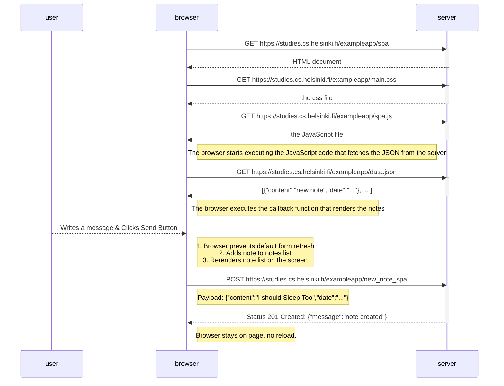

```mermaid
sequenceDiagram
    participant user
    participant browser
    participant server

    browser->>server: GET https://studies.cs.helsinki.fi/exampleapp/spa
    activate server
    server-->>browser: HTML document
    deactivate server

    browser->>server: GET https://studies.cs.helsinki.fi/exampleapp/main.css
    activate server
    server-->>browser: the css file
    deactivate server

    browser->>server: GET https://studies.cs.helsinki.fi/exampleapp/spa.js
    activate server
    server-->>browser: the JavaScript file
    deactivate server

    Note right of browser: The browser starts executing the JavaScript code that fetches the JSON from the server

    browser->>server: GET https://studies.cs.helsinki.fi/exampleapp/data.json
    activate server
    server-->>browser: [{"content":"new note","date":"..."}, ... ]
    deactivate server

    Note right of browser: The browser executes the callback function that renders the notes

    user-->>browser: Writes a message & Clicks Send Button
    
    Note right of browser: 1. Browser prevents default form refresh<br/>2. Adds note to notes list<br/>3. Rerenders note list on the screen

    browser->>server: POST https://studies.cs.helsinki.fi/exampleapp/new_note_spa
    activate server
    Note right of browser: Payload: {"content":"I should Sleep Too","date":"..."}
    
    server-->>browser: Status 201 Created: {"message":"note created"}
    deactivate server
    
    Note right of browser: Browser stays on page, no reload.
```