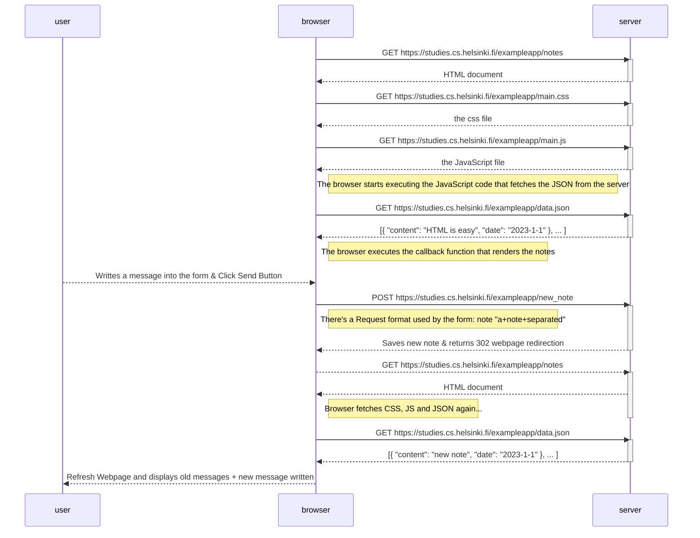

```mermaid
sequenceDiagram
    participant user
    participant browser
    participant server
 

    browser->>server: GET https://studies.cs.helsinki.fi/exampleapp/notes
    activate server
    server-->>browser: HTML document
    deactivate server

    browser->>server: GET https://studies.cs.helsinki.fi/exampleapp/main.css
    activate server
    server-->>browser: the css file
    deactivate server

    browser->>server: GET https://studies.cs.helsinki.fi/exampleapp/main.js
    activate server
    server-->>browser: the JavaScript file
    deactivate server

    Note right of browser: The browser starts executing the JavaScript code that fetches the JSON from the server

    browser->>server: GET https://studies.cs.helsinki.fi/exampleapp/data.json
    activate server
    server-->>browser: [{ "content": "HTML is easy", "date": "2023-1-1" }, ... ]
    deactivate server

    Note right of browser: The browser executes the callback function that renders the notes

    user-->>browser: Writtes a message into the form & Click Send Button
    browser->>server: POST https://studies.cs.helsinki.fi/exampleapp/new_note
    activate server
    Note right of browser: There's a Request format used by the form: note	"a+note+separated"
    
    server-->>browser: Saves new note & returns 302 webpage redirection
    deactivate server
    
    browser-->>server: GET https://studies.cs.helsinki.fi/exampleapp/notes 
    activate server
    server-->>browser: HTML document
    Note right of browser: Browser fetches CSS, JS and JSON again...
    deactivate server

    browser->>server: GET https://studies.cs.helsinki.fi/exampleapp/data.json
    activate server
    server-->>browser: [{ "content": "new note", "date": "2023-1-1" }, ... ]
    deactivate server


    browser-->>user: Refresh Webpage and displays old messages + new message written
```